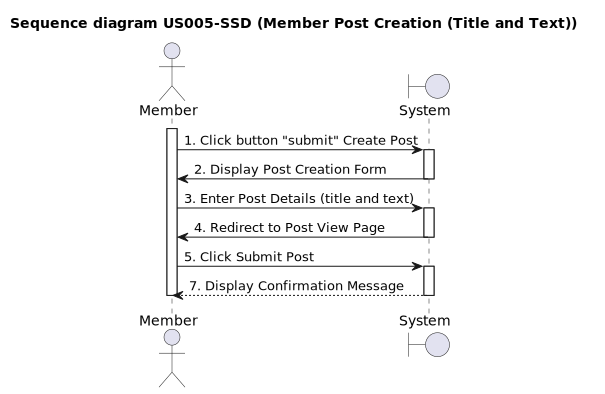
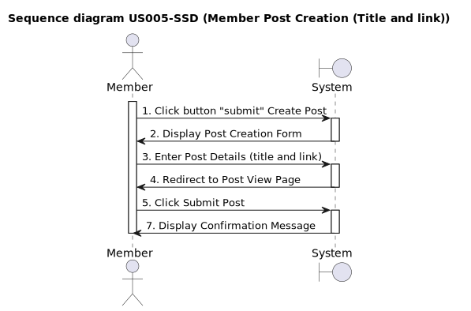
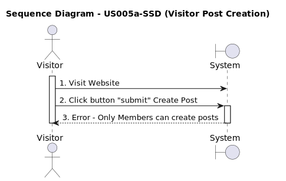
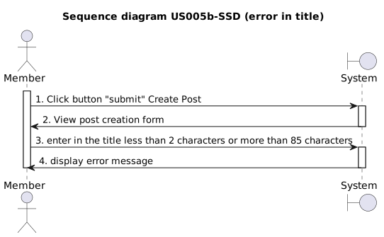
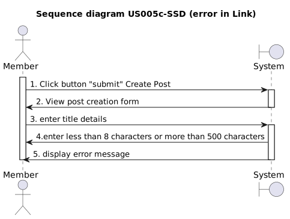

# US005 - Creation a Post

## 1. Requirements Engineering

### 1.1. User Story Description

*As a user, I want to have the ability to create a post in the system.*

### 1.2. Customer Specifications and Clarifications 


### 1.3. Acceptance Criteria

* **AC1:** The user must be logged in as a member to create a post, and a success message "logged in" must be displayed.
* **AC1.1:** If the user does not have valid credentials, error messages should be displayed. Examples of error messages are: "Had some trouble logging in. An unexpected error occurred" or "Had some trouble logging in. Password doesn't match error".
* **AC2:** There must be a "submit" button available to initiate the post creation.
* **AC3:** The post creation form must include the following fields (Title, text or Link)
* **AC3.1:** The post must have a title with a minimum of 2 and a maximum of 85 characters, if not the following error message must be displayed "Yeahhhh, title should be 2 to 85 characters. Your was"
* **AC3.2:** The post text should be between 20 and 10000 characters. If it doesn't meet this requirement, display the error message: "Text posts should be 20 to 10000 characters. Yours was".
* **AC3.3:** The post must a Link sould be between 8 and 500  characters. If it doesn´t meet this requirement, display the error message: "Yeahhhhh, link posts should be 8 to 500 characters. Yours was".
* **AC3.3.1:** The link Text Box needs to come in the format "http//:" + "text".
* **AC4:** There must be a "submit " button available to conclude the post submission.
* **AC5:** After submitting the post, a confirmation message must be displayed "Done-zo!".

### 1.4. Found out Dependencies
To become a member, the user must have a created account and complete the login process US001 [Register New Account](../../US001/01.requirements-engineering/US001.md) *

### 1.5 Input and Output Data

#### Input Data:

* Post title;
* Post text;

#### Output data:

* Confirmation message validating the submission.*

### 1.6. System Sequence Diagram (SSD)

*Insert an SSD here describing the anticipated Actor-System interactions and how the data is inputted and sent to fulfill the requirement. Number all the interactions.*

<h6 align="center">












</h6>

### 1.7 Other Relevant Remarks

*Nothing relevant to add* 

### 1.8 Bugs

#### **A - Bug - Create a Post with a Link**

**A.1 - Description:**

* Misalignment of the boundary conditions for post creation (link) between Front-end and Back-end.

<br>

**A.2 - Detailed Description:**

* For the Web App. DDD "Post Creation with a Link" functionality, both the title and the link must adhere to the boundary conditions set forth in the acceptance criteria **AC3.3** as per the business rules of the web application, which specifies for the **link**, a maximum length of 500 characters and a minimum length of 8 characters.

<br>

**Create Post (Link) Business Rule (Front-End set pre-conditions):**

````typescript
// PostUtil.ts Source Code

import { Post } from "../models/Post";
import { PostDTO } from "../dtos/postDTO";

export class PostUtil {
  public static maxTextLength: number = 10000;
  public static minTextLength: number = 20;

  public static maxTitleLength: number = 85;
  public static minTitleLength: number = 2;

  public static maxLinkLength: number = 500;                            // Link Upper Bound condition
  public static minLinkLength: number = 8;                              // Link Lower Bound condition

  public static computePostAfterUpvote (post: Post): Post {
    return {
      ...post,
      wasUpvotedByMe: post.wasUpvotedByMe ? false : true,
      points: post.wasUpvotedByMe ? (post.points - 1) : (post.points + 1)
    } 
  }

  public static computePostAfterDownvote (post: Post): Post {
    return {
      ...post,
      wasDownvotedByMe: post.wasDownvotedByMe ? false : true,
      points: post.wasDownvotedByMe ? (post.points + 1) : (post.points - 1)
    } 
  }

  public static toViewModel (dto: PostDTO): Post {
    return {
      slug: dto.slug,
      title: dto.title,
      createdAt: dto.createdAt,
      postAuthor: dto.memberPostedBy.user.username,
      numComments: dto.numComments,
      points: dto.points,
      type: dto.type,
      text: dto.text,
      link: dto.link,
      wasUpvotedByMe: dto.wasUpvotedByMe,
      wasDownvotedByMe: dto.wasDownvotedByMe
    }
  }
}
````

<br>

* However, during the API unit tests conducted, it was observed that the system accepted a link with 2083 characters, violating the maximum length condition and resulting in an unexpected behavior.

<br>

**A.3 - Failed Acceptance Criterias:**

* [AC3.3](/docs/sprintA/US005/01.requirements-engineering/US005.md#13-acceptance-criteria)

<br>

**A.4 - Sequence Diagram**

<h6 align="center">


</h6>

<br>

**A.5 - Severity:**

* **Medium**

<br>

**A.6 - Current Behaviour:**

* The system accepts links with less than 8 characters, resulting in a status code of 200 instead of the expected 500.

* Additionally, the system accepts links with more than 500 characters, also resulting in a status code of 200 instead of the expected 500.

<br>

**A.7 - Expected Behaviour:**

* The Web App. should reject both int the front-end and in the back-end, the creation of links that do not comply with the Business Rules and do not meet the pre-established boundary conditions (minimum 8 characters and maximum 500 characters) and return a status code 500 in the case of non-compliance.

<br>

**A.8 - Date and Time of Occurrence:**

* September 21, 2023, at 9:00 PM

<br>

**A.9 - Steps to Reproduce the Issue:**

>1. Access the API test creation area, specifically US005 (post creation).

>2. Perform a member login test to obtain the access token.

>3. Execute a creation test with the title "US005 - errolink7" and the link "www.b", with a status code of 500.

>4. Execute a creation test with the title "US005 – errolink" and the link "www.google.com/.... oogleerro2083inke84" (with 2083 characters), also with a status code of 500.

>5. After the command "npm run test:api:us005," the expected status code should be 500, but the received status code is 200.

>6. Verify if the maximum and minimum boundary conditions (maximum 500 characters and minimum 8 characters) are not being respected, just as on the front-end.

<br>

**A.10 - Status:**

* **Bug Resolved**
* <a href="https://github.com/Departamento-de-Engenharia-Informatica/switch-qa-23-project-switch-qa-23-3/commit/ae3d02cf83acde9cd326cc4de7fede410ca33401">GitHub Commit History - Bug Fix (12th of September 2023)</a>

<br>

**A.11 - Code Modification in "PostLink.ts":**

* Incorporation in the back-end source code concerning the class "PostLink" of the missing parameters required for the link validation, which were already present in the front-end source code.

* These modifications were implemented to align the back-end with the front-end and ensure that both the text and title boundaries are handled consistently in the program.

* Now, the system correctly validates links according to the established conditions.

 <br>

```typescript
//From "postLink.ts" file
export class PostLink extends ValueObject<PostLinkProps> {
  public static minLength: number = 8;       // 1st modification
  public static maxLength: number = 500;     // 1st modification
  
  get url (): string {
    return this.props.url;
  }

  private constructor (props: PostLinkProps) {
    super(props);
  };

  public static create (props: PostLinkProps): Result<PostLink> {
    const nullGuard = Guard.againstNullOrUndefined(props.url, 'url');
    
    if (nullGuard.isFailure) {
      return Result.fail<PostLink>(nullGuard.getErrorValue());
    } 

    const minGuard = Guard.againstAtLeast(this.minLength, props.url);
    const maxGuard = Guard.againstAtMost(this.maxLength, props.url);

    if (minGuard.isFailure) {
      return Result.fail<PostLink>(minGuard.getErrorValue());
    }
    if (maxGuard.isFailure) {
      return Result.fail<PostLink>(maxGuard.getErrorValue());
    } 
    return Result.ok<PostLink>(new PostLink(props));    // 2nd modification
  }
}
```

<br>

**A.12 - API Unit Testing**

**A.12.1 - Unit Tests - Prior to Bug Fix**

**1 - Test Specs:**
 
    - Test File: us005.api.test.ts
    - Expected Result:
      - Link with 6 character up to 2082 characters: Status Code 200
      - Link up to 5 characters: Status Code 500
      - Link starting from 2083 characters: Status Code 500

<br>

**2 - Test File Source Code:**

>* <a href="https://github.com/Departamento-de-Engenharia-Informatica/switch-qa-23-project-switch-qa-23-3/commit/2d5fc32c782be0b2bdfc49b140e35d486f36e130">GitHub Commit History - Pre Bug Fix API unit tests (22nd of June 2023)</a>

<br>

```typescript
//From "us005.api.test.ts" test file

//parameters of create a post  title success and link success starting from 6 characters (lower boundary 8 characters)
it("US005 - Creates a post link - starting from 6 characters - Status Code: 200 (lower boundary 8 characters) ", async (): Promise<void> => {
    const response = await posts.postCreatePost(accessToken, "US005 - link6characters", "link", "", "www.bu");
    expect(response.status).toBe(200);
});

//parameters of create a post  title sucess and link success 2082 characters (upper boundary 500 characters)
it("US005- Creates a post link - up to 2082 characters - Status Code 200 (upper boundary 500 characters)", async (): Promise<void> => {
    const response = await posts.postCreatePost(accessToken, "US005 - link2082characters", "link", "", "www.google.com/googlegooglegooglegooglegooglegooglegooglegooglegooglegooglegooglegooglegooglegooglegooglegooglegooglegooglegooglegooglegooglegooglegooglegooglegooglegooglegooglegooglegooglegooglegooglegooglegooglegooglegooglegooglegooglegooglegooglegooglegooglegooglegooglegooglegooglegooglegooglegooglegooglegooglegooglegooglegooglegooglegooglegooglegooglegooglegooglegooglegooglegooglegooglegooglegooglegooglegooglegooglegooglegooglegooglegooglegooglegooglegooglegooglegooglegooglegooglegooglegoogle.google.com/googlegooglegooglegooglegooglegooglegooglegooglegooglegooglegooglegooglegooglegooglegooglegooglegooglegooglegooglegooglegooglegooglegooglegooglegooglegooglegooglegooglegooglegooglegooglegooglegooglegooglegooglegooglegooglegooglegooglegooglegooglegooglegooglegooglegooglegooglegooglegooglegooglegooglegooglegooglegooglegooglegooglegooglegooglegooglegooglegooglegooglegooglegooglegooglegooglegooglegooglegooglegooglegooglegooglegooglegooglegooglegooglegooglegooglegooglegooglegooglegooglegooglegooglegooglegooglegooglegooglegooglegooglegooglegooglegooglegooglegooglegooglegooglegooglegooglegooglegooglegooglegooglegooglegooglegooglegooglegooglegooglegooglegooglegooglegooglegooglegooglegooglegooglegooglegooglegooglegooglegooglegooglegooglegooglegooglegooglegooglegooglegooglegooglegooglegooglegooglegooglegooglegooglegooglegooglegooglegooglegooglegooglegooglegooglegooglegooglegooglegooglegooglegooglegooglegooglegooglegooglegooglegooglegooglegooglegooglegooglegooglegoogle.google.com/googlegooglegooglegooglegooglegooglegooglegooglegooglegooglegooglegooglegooglegooglegooglegooglegooglegooglegooglegooglegooglegooglegooglegooglegooglegooglegooglegooglegooglegooglegooglegooglegooglegooglegooglegooglegooglegooglegooglegooglegooglegooglegooglegooglegooglegooglegooglegooglegooglegooglegooglegooglegooglegooglegooglegooglegooglegooglegooglegooglegooglegooglegooglegooglegooglegooglegooglegooglegooglegooglegooglegooglegooglegooglegooglegooglegooglegooglegooglegooglegooglegoogle.com/googlegooglegooglegooglegooglegooglegooglegooglegoooglegoooglegooogelgoogleerro2083ink82");
    expect(response.status).toBe(200);
});

//parameters of create a post title success and link error up to 5 characters (lower boundary 8 characters)
it("US005 - Creates a post error link - up to 5 characters - Status Code: 500 (lower boundary 8 characters) ", async (): Promise<void> => {
    const response = await posts.postCreatePost(accessToken, "US005 - errorlink5characters", "link", "", "www.b");
    expect(response.status).toBe(500);
});

//parameters of create a post title sucess and link error starting from 2083 characters (upper boundary 500 characters)
it("US005 - Creates a post error link - starting from 2083 characters - Status Code: 500 (upper boundary 500 characters)", async (): Promise<void> => {
    const response = await posts.postCreatePost(accessToken, "US005 - errorlink2083characters", "link", "", "www.google.com/googlegooglegooglegooglegooglegooglegooglegooglegooglegooglegooglegooglegooglegooglegooglegooglegooglegooglegooglegooglegooglegooglegooglegooglegooglegooglegooglegooglegooglegooglegooglegooglegooglegooglegooglegooglegooglegooglegooglegooglegooglegooglegooglegooglegooglegooglegooglegooglegooglegooglegooglegooglegooglegooglegooglegooglegooglegooglegooglegooglegooglegooglegooglegooglegooglegooglegooglegooglegooglegooglegooglegooglegooglegooglegooglegooglegooglegooglegooglegooglegoogle.google.com/googlegooglegooglegooglegooglegooglegooglegooglegooglegooglegooglegooglegooglegooglegooglegooglegooglegooglegooglegooglegooglegooglegooglegooglegooglegooglegooglegooglegooglegooglegooglegooglegooglegooglegooglegooglegooglegooglegooglegooglegooglegooglegooglegooglegooglegooglegooglegooglegooglegooglegooglegooglegooglegooglegooglegooglegooglegooglegooglegooglegooglegooglegooglegooglegooglegooglegooglegooglegooglegooglegooglegooglegooglegooglegooglegooglegooglegooglegooglegooglegooglegooglegooglegooglegooglegooglegooglegooglegooglegooglegooglegooglegooglegooglegooglegooglegooglegooglegooglegooglegooglegooglegooglegooglegooglegooglegooglegooglegooglegooglegooglegooglegooglegooglegooglegooglegooglegooglegooglegooglegooglegooglegooglegooglegooglegooglegooglegooglegooglegooglegooglegooglegooglegooglegooglegooglegooglegooglegooglegooglegooglegooglegooglegooglegooglegooglegooglegooglegooglegooglegooglegooglegooglegooglegooglegooglegooglegooglegooglegooglegooglegoogle.google.com/googlegooglegooglegooglegooglegooglegooglegooglegooglegooglegooglegooglegooglegooglegooglegooglegooglegooglegooglegooglegooglegooglegooglegooglegooglegooglegooglegooglegooglegooglegooglegooglegooglegooglegooglegooglegooglegooglegooglegooglegooglegooglegooglegooglegooglegooglegooglegooglegooglegooglegooglegooglegooglegooglegooglegooglegooglegooglegooglegooglegooglegooglegooglegooglegooglegooglegooglegooglegooglegooglegooglegooglegooglegooglegooglegooglegooglegooglegooglegooglegooglegoogle.com/googlegooglegooglegooglegooglegooglegooglegooglegoooglegoooglegooogelgoogleerro2083inke83");
    expect(response.status).toBe(500);
});
```

<br>

**3 - Test Report:**

<h6 align="center">


</h6>

<br>


* **A.12.2 - Unit Tests - Post Source Code Changes for Bug Fix**

**1 - Test Specs:**
 
    - Test File: us005.bug.test.ts
    - Expected Result:
      - Link with 8 character up to 500 characters: Status Code 200
      - Link up to 7 characters: Status Code 500
      - Link starting from 501 characters: Status Code 500

<br>

**2 - Test File Source Code:**

>* <a href="https://github.com/Departamento-de-Engenharia-Informatica/switch-qa-23-project-switch-qa-23-3/commit/ae3d02cf83acde9cd326cc4de7fede410ca33401">GitHub Commit History - Post Bug Fix API unit tests (12th of September 2023)</a>

<br>

```typescript
//From "us005.bug.test.ts" test file

//link border changes

// parameters of create a post  title sucess and link sucess (8 characters)
it("US005 - Creates a post sucess link 8 characters", async (): Promise<void> => {
    const response = await posts.postCreatePost(accessToken, "US005 - link7", "link", "", "www.bcom");
    expect(response.status).toBe(200);
});

// parameters of create a post  title sucess and link sucess (500 characters)
it("US005 - Creates a post sucess link 500 characters", async (): Promise<void> => {
    const response = await posts.postCreatePost(accessToken, "US005 - link500", "link", "", "www.google.com/googlegooglegooglegooglegooglegooglegooglegooglegooglegoogle.com/googlegooglegooglegooglegooglegooglegooglegoooglegoooglegooogelgoogleerrocom/googlegooglegooglegooglegooglegooglegooglegoooglegoooglegooogelgoogleerrocom/googlegooglegooglegooglegooglegooglegooglegoooglegoooglegooogelgoogleerrocom/googlegooglegooglegooglegooglegooglegooglegoooglegoooglegooogelgoogleerrocom/googlegooglegooglegooglegooglegooglegooglegoooglegoooglegooogelgoogleerrocom/googlegooglegooglegooglegookhfdz500");
    expect(response.status).toBe(200);
});

// parameters of create a post with link error (7 characters)
it("US005 - Creates a post error link 7 characters", async (): Promise<void> => {
    const response = await posts.postCreatePost(accessToken, "US005 - link6", "link", "", "www.bcm");
    expect(response.status).toBe(500);
});

// parameters of create a post with link error (501 characters)
it("US005 - Creates a post error link 501 characters", async (): Promise<void> => {
    const response = await posts.postCreatePost(accessToken, "US005 - link501", "link", "", "www.google.com/googlegooglegooglegooglegooglegooglegooglegooglegooglegoogle.com/googlegooglegooglegooglegooglegooglegooglegoooglegoooglegooogelgoogleerrocom/googlegooglegooglegooglegooglegooglegooglegoooglegoooglegooogelgoogleerrocom/googlegooglegooglegooglegooglegooglegooglegoooglegoooglegooogelgoogleerrocom/googlegooglegooglegooglegooglegooglegooglegoooglegoooglegooogelgoogleerrocom/googlegooglegooglegooglegooglegooglegooglegoooglegoooglegooogelgoogleerrocom/googlegooglegooglegooglegookhfdz5001");
    expect(response.status).toBe(500);
});
```

<br>

**3 - Test Report:**

<h6 align="center">


</h6>

<br>

## 2. OO Analysis

### 2.1. Relevant Domain Model Excerpt 
*By default, an existing email account is required to create an account in the system* 


### 2.2. Other Remarks

*Use this section to capture some aditional notes/remarks that must be taken into consideration into the design activity. In some case, it might be usefull to add other analysis artifacts (e.g. activity or state diagrams).* 

## 3. Design - User Story Realization 

### 3.1. Rationale

**The rationale grounds on the SSD interactions and the identified input/output data.**

| Interaction ID | Question: Which class is responsible for... | Answer  | Justification (with patterns)  |
|:-------------  |:--------------------- |:------------|:---------------------------- |
| Step 1  		 |							 |             |                              |
| Step 2  		 |							 |             |                              |
| Step 3  		 |							 |             |                              |
| Step 4  		 |							 |             |                              |
| Step 5  		 |							 |             |                              |
| Step 6  		 |							 |             |                              |              
| Step 7  		 |							 |             |                              |
| Step 8  		 |							 |             |                              |
| Step 9  		 |							 |             |                              |
| Step 10  		 |							 |             |                              |  


### Systematization ##

According to the taken rationale, the conceptual classes promoted to software classes are: 

 * Class1
 * Class2
 * Class3

Other software classes (i.e. Pure Fabrication) identified: 
 * xxxxUI  
 * xxxxController

## 3.2. Sequence Diagram (SD)

*In this section, it is suggested to present an UML dynamic view stating the sequence of domain related software objects' interactions that allows to fulfill the requirement.* 


## 3.3. Class Diagram (CD)

*In this section, it is suggested to present an UML static view representing the main domain related software classes that are involved in fulfilling the requirement as well as and their relations, attributes and methods.*


# 4. Tests 
*In this section, it is suggested to systematize how the tests were designed to allow a correct measurement of requirements fulfilling.* 

**_DO NOT COPY ALL DEVELOPED TESTS HERE_**

**Test 1:** Check that it is not possible to create an instance of the Example class with null values. 

	@Test(expected = IllegalArgumentException.class)
		public void ensureNullIsNotAllowed() {
		Exemplo instance = new Exemplo(null, null);
	}

*It is also recommended to organize this content by subsections.* 

# 5. Construction (Implementation)

*In this section, it is suggested to provide, if necessary, some evidence that the construction/implementation is in accordance with the previously carried out design. Furthermore, it is recommeded to mention/describe the existence of other relevant (e.g. configuration) files and highlight relevant commits.*

*It is also recommended to organize this content by subsections.* 

# 6. Integration and Demo 

*In this section, it is suggested to describe the efforts made to integrate this functionality with the other features of the system.*

# 7. Observations

*In this section, it is suggested to present a critical perspective on the developed work, pointing, for example, to other alternatives and or future related work.*


