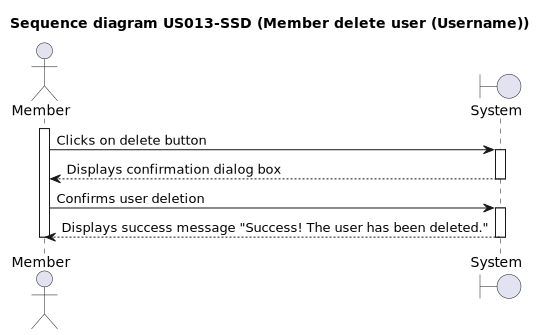
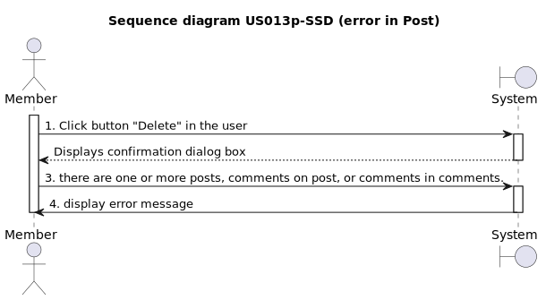
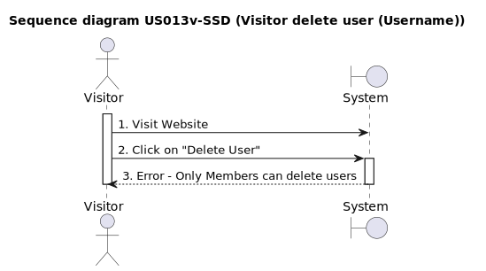
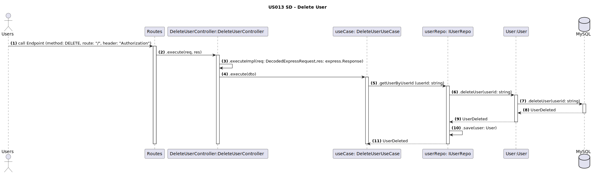

# US013 - Delete User

<!--Test  to commit due to probaly python version issues 22-10-2023-->

## 1. Requirements Engineering
* As a member, I want to have a delete button on the the Member Details area, so that I can delete a user.*

### 1.1. User Story Description

### 1.2. Customer Specifications and Clarifications
Currently it is not possible to delete user, so once a user is created it cannot be removed from the application. In order to allow for better members management its necessary to create a user delete feature that enables users or admins to delete a user profile.

**From the client clarifications:**

>**Question:** Who can delete a user?
>**Answer:**  Only members or Admins can delete profiles.

>**Question:** Which information is necessary to delete a user?
>**Answer:** Only the member Username is required.

>**Question:** How can a user be deleted?
>**Answer:** A Delete button must be available on the Member Details area.

>**Question:** What if the username doesn´t exist?
>**Answer:** A message must be returned saying the profile is non-existent.

>**Question:** When can a user be deleted?
>**Answer:** Anytime a logged user acess the Member Details area the delete button must be available.

### 1.3. Acceptance Criteria

- **AC1:** The user must be logged in as a member and a success message "logged in" must be displayed.
    - **AC1.1:** If the user does not have valid credentials, error messages should be displayed. Examples of error messages are: "Had some trouble logging in. An unexpected error occurred" or "Had some trouble logging in. Password doesn't match error".

- **AC2:** The delete button must be visible on the Member Details area. 
    - **AC2.1:** Once the button is activated a pop-up window must be displayed asking for the username of the profile to be deleted.
    - **AC2.2:** After the profile to be deleted is inserted the user must select the "Delete user" option on the pop-up.
        - **AC2.2.1:** If the delete button of the pop-up is activated with no name inserted, or a non-existent username, or an invalid username, then a messagem must be displayed: "No valid username informed."
        - **AC2.2.2:** If the delete button of the pop-up is activated with a valid username, then a window for second confirmation must apbe displayed with the message: "Are you sure you want to delete the "username" profile?".
            - **AC:2.2.2.1** If user selects "Yes" on the second confirmation window, then the profile chosen must be deleted and a message of sucess must be displayed.
            - **AC:2.2.2.1** If user selects "No" on the second confirmation window, then no user profile must be deleted, the message "No user deleted." must be displayed.
        - **AC2.2.3:** If the user wants to cancel de deleting process the option "Cancel" of the pop-up must be selected.
            - **AC2.2.3.1:** The Cancel option is only possible before the user selects the "Delete User" option on the pop-up.
    - **AC2.3:** If any error occurs or it is not possible to delete the user (due to system constraints or errors), an error message should be displayed, stating "It's not possible to delete the user at this time. Please try again later."
    - **AC2.4:** Upon successful deletion of the user, a success message should be displayed, confirming "Success! The user has been deleted."

- **AC3:** Only users without any posts, comments, or replies can be deleted.
    - **AC3.1:** The user can only delete his own profile, unless its an Admin profile.
        - **AC3.1.1:** If the user is has an Admin profile, then he must be allowed to delete any profile, including his.
        - **AC3.1.2:** If a non-Admin user tries to delete another profile, then the operation must not be allowed and a message must be displayed saying: "Admin authorization required."

### 1.4. Found out Dependencies

*To become a member, the user must have a created account and complete the login process US001 [Register New Account](../../US001/01.requirements-engineering/US001.md) *

*As a Member, I want to post US005 [Creation a Post](../../US005/01.requirements-engineering/US005.md) *
*As a Member, I want to comment a post US007 [Creation Comment a Post](../../US007/01.requirements-engineering/US007.md)*
*As a Member, I want to comment a comment US008 [Creation Comment a Comment](../../US008/01.requirements-engineering/US008.md)*
*As a member I want to see the "display information Member" page[Display Information Member](../../US013/01.requirements-engineering/US013.md)*

### 1.5 Input and Output Data

#### Input Data:

- Username

#### Output data:

- Confirmation message validating the deleted user.\*

### 1.6. System Sequence Diagram (SSD)

_Insert an SSD here describing the anticipated Actor-System interactions and how the data is inputted and sent to fulfill the requirement. Number all the interactions._

<h6 align="center">

</h6>

### 1.7 Other Relevant Remarks

_Nothing relevant to add_

###

### **1.8 Sequence Diagram**

 

## 2. OO Analysis

### 2.1. Relevant Domain Model Excerpt

_By default, an existing email account is required to create an account in the system_

### 2.2. Other Remarks

_Use this section to capture some aditional notes/remarks that must be taken into consideration into the design activity. In some case, it might be usefull to add other analysis artifacts (e.g. activity or state diagrams)._

## 3. Design - User Story Realization

### 3.1. Rationale

**The rationale grounds on the SSD interactions and the identified input/output data.**

| Interaction ID | Question: Which class is responsible for... | Answer | Justification (with patterns) |
| :------------- | :------------------------------------------ | :----- | :---------------------------- |
| Step 1         |                                             |        |                               |
| Step 2         |                                             |        |                               |
| Step 3         |                                             |        |                               |
| Step 4         |                                             |        |                               |
| Step 5         |                                             |        |                               |
| Step 6         |                                             |        |                               |
| Step 7         |                                             |        |                               |
| Step 8         |                                             |        |                               |
| Step 9         |                                             |        |                               |
| Step 10        |                                             |        |                               |

### Systematization

According to the taken rationale, the conceptual classes promoted to software classes are:

- Class1
- Class2
- Class3

Other software classes (i.e. Pure Fabrication) identified:

- xxxxUI
- xxxxController

## 3.2. Sequence Diagram (SD)

_In this section, it is suggested to present an UML dynamic view stating the sequence of domain related software objects' interactions that allows to fulfill the requirement._

## 3.3. Class Diagram (CD)

_In this section, it is suggested to present an UML static view representing the main domain related software classes that are involved in fulfilling the requirement as well as and their relations, attributes and methods._

# 4. Tests

_In this section, it is suggested to systematize how the tests were designed to allow a correct measurement of requirements fulfilling._

**_DO NOT COPY ALL DEVELOPED TESTS HERE_**

**Test 1:** Check that it is not possible to create an instance of the Example class with null values.

    @Test(expected = IllegalArgumentException.class)
    	public void ensureNullIsNotAllowed() {
    	Exemplo instance = new Exemplo(null, null);
    }

_It is also recommended to organize this content by subsections._

# 5. Construction (Implementation)

_In this section, it is suggested to provide, if necessary, some evidence that the construction/implementation is in accordance with the previously carried out design. Furthermore, it is recommeded to mention/describe the existence of other relevant (e.g. configuration) files and highlight relevant commits._

_It is also recommended to organize this content by subsections._

# 6. Integration and Demo

_In this section, it is suggested to describe the efforts made to integrate this functionality with the other features of the system._

# 7. Observations

_In this section, it is suggested to present a critical perspective on the developed work, pointing, for example, to other alternatives and or future related work._
