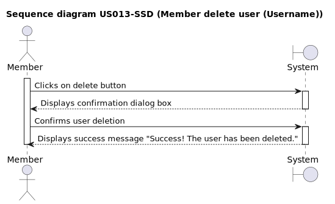
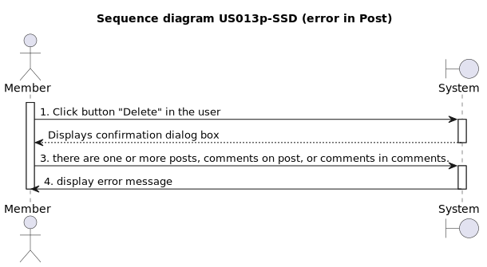
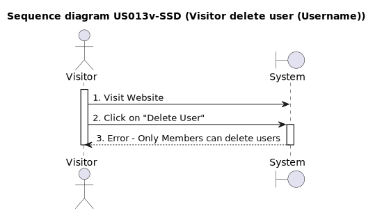

# US016 -  Top Commented Post Daily

<!--Test  to commit due to probaly python version issues 22-10-2023-->

## 1. Requirements Engineering
* As a Member, I wish to know the post with more comments for a specific day.*

### 1.1. User Story Description

### 1.2. Customer Specifications and Clarifications
As an active member, I often wish to keep track of what's happening day by day on the platform and discover which discussions are generating the most interest and engagement from users. This feature will help me stay informed about the most active and engaging discussions in our online environment.

**From the client clarifications:**

>**Question:** Which specific day?
>**Answer:**  The day selected by the user.

>**Question:** where must the information be displayed?
>**Answer:** in the statistcs section.

>**Question:** Will the functionality allow users to select any past date, or will there be limitations?
>**Answer:** Yes any date in the past can be select.

>**Question:** In the case of multiple posts having the same maximum number of comments for a specific day, how will these posts be displayed?
>**Answer:** All the posts will be presented as a list.

### 1.3. Acceptance Criteria

- **AC1:** The user should have the option to specify a particular date or day within the platform.

- **AC2:** The system should retrieve and display the post with the highest number of comments for the selected date.

- **AC3:** In case of multiple posts having the same highest number of comments, the system should display all of them.

- **AC4:** The functionality should be easily accessible within the statis menu.

### 1.4. Found out Dependencies

*For members: depends on US001* [Register New Account](../../US001/01.requirements-engineering/US001.md)*

*To become a member, the user must have a created account and complete the login process US001 [Register New Account](../../US001/01.requirements-engineering/US001.md) *

*As a Member, I want to post US005 [Creation a Post](../../US005/01.requirements-engineering/US005.md) *

*As a Member, I want to comment a post US007 [Creation Comment a Post](../../US007/01.requirements-engineering/US007.md)*

### 1.5 Input and Output Data

#### Input Data:

- 

#### Output data:

- 

### 1.6. System Sequence Diagram (SSD)

_Insert an SSD here describing the anticipated Actor-System interactions and how the data is inputted and sent to fulfill the requirement. Number all the interactions._

<h6 align="center">

</h6>

### 1.7 Other Relevant Remarks

_Nothing relevant to add_

###

### **1.8 Sequence Diagram**

 

## 2. OO Analysis

### 2.1. Relevant Domain Model Excerpt

_By default, an existing email account is required to create an account in the system_

### 2.2. Other Remarks

_Use this section to capture some aditional notes/remarks that must be taken into consideration into the design activity. In some case, it might be usefull to add other analysis artifacts (e.g. activity or state diagrams)._

## 3. Design - User Story Realization

### 3.1. Rationale

**The rationale grounds on the SSD interactions and the identified input/output data.**

| Interaction ID | Question: Which class is responsible for... | Answer | Justification (with patterns) |
| :------------- | :------------------------------------------ | :----- | :---------------------------- |
| Step 1         |                                             |        |                               |
| Step 2         |                                             |        |                               |
| Step 3         |                                             |        |                               |
| Step 4         |                                             |        |                               |
| Step 5         |                                             |        |                               |
| Step 6         |                                             |        |                               |
| Step 7         |                                             |        |                               |
| Step 8         |                                             |        |                               |
| Step 9         |                                             |        |                               |
| Step 10        |                                             |        |                               |

### Systematization

According to the taken rationale, the conceptual classes promoted to software classes are:

- Class1
- Class2
- Class3

Other software classes (i.e. Pure Fabrication) identified:

- xxxxUI
- xxxxController

## 3.2. Sequence Diagram (SD)

_In this section, it is suggested to present an UML dynamic view stating the sequence of domain related software objects' interactions that allows to fulfill the requirement._

## 3.3. Class Diagram (CD)

_In this section, it is suggested to present an UML static view representing the main domain related software classes that are involved in fulfilling the requirement as well as and their relations, attributes and methods._

# 4. Tests

_In this section, it is suggested to systematize how the tests were designed to allow a correct measurement of requirements fulfilling._

**_DO NOT COPY ALL DEVELOPED TESTS HERE_**

**Test 1:** Check that it is not possible to create an instance of the Example class with null values.

    @Test(expected = IllegalArgumentException.class)
    	public void ensureNullIsNotAllowed() {
    	Exemplo instance = new Exemplo(null, null);
    }

_It is also recommended to organize this content by subsections._

# 5. Construction (Implementation)

_In this section, it is suggested to provide, if necessary, some evidence that the construction/implementation is in accordance with the previously carried out design. Furthermore, it is recommeded to mention/describe the existence of other relevant (e.g. configuration) files and highlight relevant commits._

_It is also recommended to organize this content by subsections._

# 6. Integration and Demo

_In this section, it is suggested to describe the efforts made to integrate this functionality with the other features of the system._

# 7. Observations

_In this section, it is suggested to present a critical perspective on the developed work, pointing, for example, to other alternatives and or future related work._
