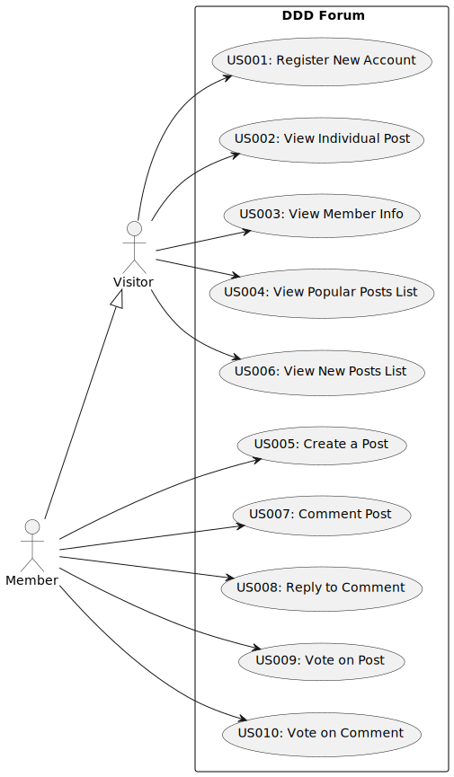

# Use Case Diagram (UCD)

**In the scope of this project, there is a direct relationship of _1 to 1_ between Use Cases (UC) and User Stories (US).**

However, be aware, this is a pedagogical simplification. On further projects and curricular units might also exist _1 to
N **and/or** N to 1 relationship between US and UC.

**Insert below the Use Case Diagram in a SVG format**

**For each UC/US, it must be provided evidences of applying main activities of the software development process (
requirements, analysis, design, tests and code). Gather those evidences on a separate file for each UC/US and set up a
link as suggested below.**

# Use Cases / User Stories

| UC/US  | Description                                                 |                   
|:-------|:------------------------------------------------------------|
| US001 | [Register New Account](../../US001/01.requirements-engineering/US001.md)          |
| US002 | [View Individual Post](../../US002/01.requirements-engineering/readme.md)|
| US003 | [View Member Info](../../US003/01.requirements-engineering/US003.md)              |
| US004 | [View Popular Posts List](../../US004/01.requirements-engineering/readme.md)       |
| US005 | [Create a Post](../../US005/01.requirements-engineering/US005.md)                 |
| US006 | [View New Posts List](../../US006/01.requirements-engineering/US006.md)           |
| US007 | [Comment Post](../../US007/01.requirements-engineering/US007.md)          |
| US008 | [Reply to Comments](../../US008/01.requirements-engineering/US008.md)            |
| US009 | [Vote on Post](../../US009/01.requirements-engineering/US009.md)       |
| US010 | [Vote on Comment](../../US010/01.requirements-engineering/US010.md)         |
| ...    | ...                                          |

